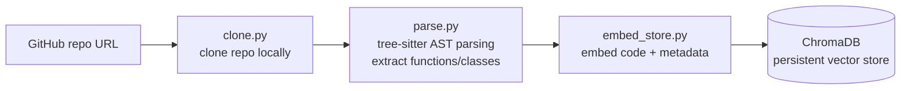
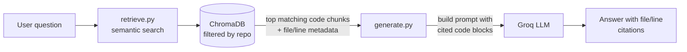

# Codebase RAG Assistant

A Retrieval-Augmented Generation (RAG) system that lets you paste **any public GitHub repository URL** and ask natural-language questions about its code — "where is authentication handled?", "how does chunking work?", "what does this class do?" — with answers grounded in the actual source and cited by file and line number.

Unlike a typical document-QA RAG project, this one is built to work across **any codebase, in any of several supported languages**, using proper AST-based parsing rather than naive text splitting.

## What it does

- Clones any public GitHub repo from a URL
- Parses source files using **tree-sitter**, extracting each function/class as a complete, syntactically-correct chunk (not an arbitrary character-count slice)
- Supports multiple languages through a single, extensible parser (Python, JavaScript, TypeScript, Java, Go, Rust, C, C++, Ruby)
- Embeds each code chunk enriched with structural metadata (file path, type, language) for better semantic retrieval
- Stores embeddings in a persistent ChromaDB vector database, tagged by repo
- Retrieves relevant code chunks per question, with file path and line number attribution
- Generates grounded, cited explanations using Groq's LLM API

## Architecture

### 1. Ingestion pipeline (run once per repo)



### 2. Query pipeline (run per user question)



## Tech stack

| Component | Tool |
|---|---|
| Repo cloning | GitPython |
| Code parsing | tree-sitter (`tree-sitter-languages`) |
| Embeddings | `sentence-transformers` (`all-MiniLM-L6-v2`, runs locally) |
| Vector store | ChromaDB (persistent, local) |
| LLM | Groq API (`openai/gpt-oss-20b`) |

## Project structure

```
codebase-rag/
├── repos/               # cloned repositories land here
├── chroma_db/           # persistent vector store (generated)
├── src/
│   ├── clone.py          # clone any repo from a URL
│   ├── parse.py           # multi-language AST parsing via tree-sitter
│   ├── embed_store.py     # embed code chunks (with structural context) and store
│   ├── retrieve.py        # semantic search with file/line attribution
│   └── generate.py        # prompt construction + Groq generation
├── requirements.txt
└── README.md
```

## Setup

1. Clone the repo and create a virtual environment:
   ```bash
   python -m venv venv
   source venv/bin/activate   # Windows: venv\Scripts\activate
   ```

2. Install dependencies:
   ```bash
   pip install -r requirements.txt
   ```

   > **Note:** `tree-sitter` and `tree-sitter-languages` are pinned to specific versions (`0.21.3` / `1.10.2`) because newer `tree-sitter` releases introduced a breaking API change that `tree-sitter-languages` has not yet caught up with.

3. Create a `.env` file in the project root:
   ```
   GROQ_API_KEY=your_key_here
   ```
   Get a free key at [console.groq.com](https://console.groq.com).

4. Index a repository:
   ```bash
   python src/embed_store.py
   # then paste any public GitHub repo URL when prompted
   ```

5. Ask a question (edit the query in `src/generate.py`):
   ```bash
   python src/generate.py
   ```

## Design notes

- **Why AST parsing instead of fixed-size chunking**: splitting code by character count risks cutting a function in half, producing chunks that are syntactically broken and useless as context. Parsing with tree-sitter guarantees every chunk is a complete, valid function or class.
- **Why tree-sitter specifically**: Python's built-in `ast` module only understands Python. tree-sitter provides consistent parsing across many languages through one API, which is what makes "paste any repo" possible rather than "paste any Python repo." This is the same category of tool used internally by code-intelligence products like GitHub's code navigation and Sourcegraph.
- **Embedding vs. display text are different**: the text embedded for search includes the file path, node type, and language alongside the code (e.g. a file path containing `auth.py` helps a query like "where is authentication handled?" match even if the word "authentication" never appears in the code itself). The text actually shown to the user and sent to the LLM is the clean, unmodified original code — enrichment is only used to improve the search signal, never surfaced directly.
- **Per-repo metadata filtering**: each indexed repo is tagged with a `repo` field in ChromaDB, following the same pattern used for multi-company filtering in a companion project — this keeps multiple indexed repos separable within a single collection.
- **Grounded, cited generation**: the system prompt requires the model to answer only from retrieved code and to cite the specific file and line number it used, so answers stay verifiable and traceable back to source.

## Known limitations

- Only languages with an entry in the `EXTENSION_TO_LANGUAGE` / `CHUNK_NODE_TYPES` mapping are parsed; unrecognized file types are skipped entirely rather than falling back to plain-text chunking.
- No filtering of non-core files (docs, themes, vendored/third-party code, tests) — everything matching a supported extension gets indexed, which can surface less relevant results in large repos.
- Retrieval does not use conversation history; only generation does, so vague follow-up questions rely entirely on the LLM's use of prior turns rather than re-targeted search.
- Large repositories can produce a large number of chunks, increasing embedding time and vector store size — no chunk-count safeguards or sampling are currently in place.

## Possible extensions

- Fall back to fixed-size chunking for file types without an AST grammar, so no file type is skipped entirely
- Filter out non-core directories (tests, docs, vendored dependencies) by default, with an option to include them
- Multi-repo comparison queries (e.g. "how does error handling differ between these two repos?")
- Re-rank retrieved chunks with a cross-encoder for higher precision
- Add a lightweight call graph so the assistant can answer "what calls this function?" style questions
